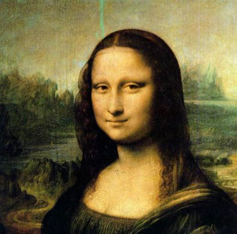
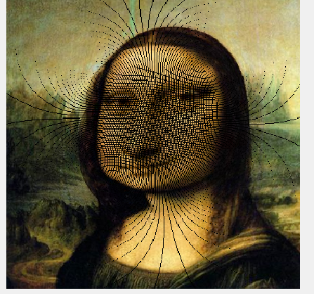
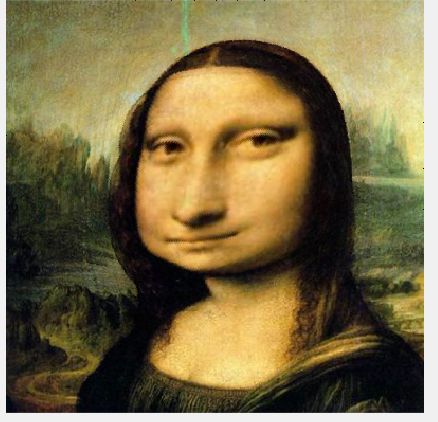
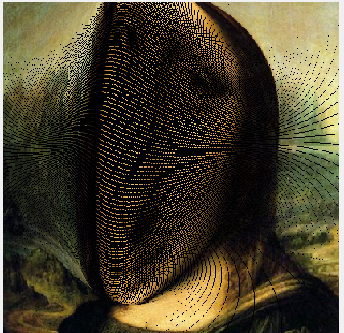
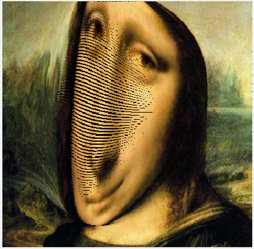
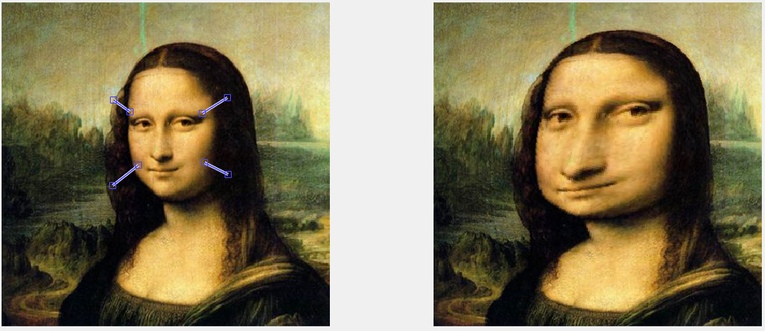
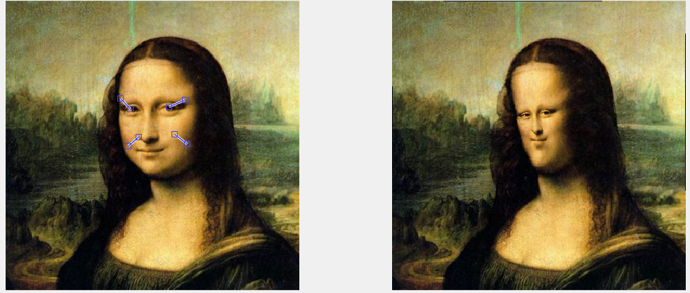

# Image Warping

> 王润泽 PB20020480
>
> 环境：Windows11 MatlabR2021a

## 1 Introduction

在 MATLAB 上实现基于径向基函数插值方法的图像拖拽变形，并实现实时用户交互

## 2 RBF Algorithm

> Radial basis functions interpolation method(RBF)

​	给定 $n$ 对控制点 $(\mathbf{p_i},\mathbf{q _ i})$，$\mathbf{p} _ i,\mathbf{q} _ i\in\mathbb{R}^2$，$i=1,\dots,n$ ，其中 $\mathbf{p_i}$ 是源点，$\mathbf{q _ i}$ 是目标点

​	**插值函数**

$$
\pmb{f}(\pmb{x})=\sum _ {i=1}^n \boldsymbol{\alpha} _ i R_i(\mathbf{x})+A\mathbf{x}+\mathbf{b}\tag1
$$

其中权重系数 $\boldsymbol{\alpha} _ i\in\mathbb{R}^{2}$，$A\in\mathbb{R}^{2\times 2}$，$\mathbf{b}\in\mathbb{R}^2$，径向基函数
$$
R_i(\mathbf{x})=\frac{1}{|\mathbf{x-p_i}|^2+d_i}\tag2
$$

​	其中 $d$ 是为了防止分母为0的情况出现。

​	在满足插值条件
$$
\mathbf{f}(\mathbf{p} _ j)=\sum _ {i=1}^n\boldsymbol{\alpha} _ i R_i(\mathbf{p} _ j)+A\mathbf{p} _ j+\mathbf{b}=\mathbf{q} _ j,\quad j=1,\dots n\tag3
$$
上述方程有 $2n+6$ 个自由度，其中 $ \boldsymbol{\alpha} _ i=(\alpha _ i^{(1)},\alpha _  i^{(2)})^T $，按照论文可选的补充约束为
$$
A=I,\mathbf{b}=\mathbf{0}\tag4
$$
​	所以关于 $\boldsymbol\alpha$ 的方程是
$$
\bold R \boldsymbol\alpha=\bold q-\bold p\tag5
$$
​	以上线性方程组可以解出权重系数 $\boldsymbol\alpha$，此时根据 $\boldsymbol\alpha$ 的值，结合 *eq(4)* 代入 *eq(1)* 即可得到图像中任意点 $\mathbf{x}$ 经过变换后的坐标 $\pmb{f}(\pmb{x})$
$$
\pmb{f}(\pmb{x})=\sum _ {i=1}^n \boldsymbol{\alpha} _ i R _ i(\mathbf{x})+\pmb{x}\tag6
$$
​	最终只要把源图像中 $\mathbf{x}$ 处的像素值代入 $\pmb{f}(\pmb{x})$ 处即可

## 3 Experiment

原图如下

    
     
    

        Figure 1:MonaLisa
    

    
 

### 3.1 Normal Warping

​	在实验过程中，为了采用恰当的 $d$ 值，不妨取 d 为所有拖动距离的平方和
$$
d=\sum_i^n\Vert\mathbf{q_i}-\mathbf{p} _ i\Vert^2/n\tag7
$$
​	得到结果：

    
     
    

        Figure 2:Normal Warping
    

    
 

在该结果中可以看出，RBF Image Warping 方法得到的图像可能出现大量缝隙，但在插值之后仍然可以得到伸缩的结果图像

### 3.2 Interpolation

​	之所以会出现缝隙现象，是因为在实验中计算 $\pmb{f}(\pmb{x})$ 值的过程中，为了给像素点位置赋值，必须强行要求取整 $round( \pmb{f}(\pmb{x}) )$ ，所以导致有些像素点的位置在给图像赋值的过程中没有渠道。

​	采取的解决办法是要对缝隙中的点进行插值。这里使用平均值插值的方法，具体实现时在对目标图像着色时记录被着色的像素点，最后再对于未着色的点，取其像素值为周边八个点中已着色点的均值。得到以下结果

    
     
    

        Figure 3:Interpolation warping
    

    
 

​	由图可见修补了缝隙。

​	但是当图形扭曲程度较大时，周围9个点可能无法弥补所有的像素,或许需要更多的周围点做平均，这又会使得图形较为模糊。

    
    
     
    

        Figure 4:左：插值前；右：插值后
    

    
 

### 3.3 RBF Reverse Method

​	为了解决上面出现的裂缝问题，另一种处理思路是，把 $\mathbf{p_i}$当作是目标点，而 $\mathbf{q _ i}$ 是源点，要做的

是以对预期变换后图像的每个像素点位置找到它对应的原位置，那么此时方程变为
$$
\begin{aligned}
R_i(\mathbf{x})&=\frac{1}{|\mathbf{x-q_i}|^2+d_i}\\
\bold R \boldsymbol\alpha&=\mathbf p-\mathbf q\\
\pmb{f}(\pmb{x})&=\sum _ {i=1}^n \boldsymbol{\alpha} _ i R_i(\mathbf{x})+\pmb{x}
\end{aligned}\tag8
$$
此时要做的是计算出每个像素点 $\mathbf{x}=(i,j)$ 对应的原位置 $\mathbf {f(x)}$，此时变换后新图像每点的像素值为 $\mathbf{f(x)}$ 处的像素值。

另外，通过阅读文献[[1]](#refer-anchor-1)，尝试了另一种 $d$ 的定义，它是对每个 $R_i(x)$ 都赋予不同的值，为距离 $\mathbf q_i$最近的其他源点的距离平方值，如果只有一组点，则简单定义 $\mathbf q$ 与 $\mathbf p$ 的距离平方和 *eq (7)*保持一致

$$
d_i=\min_{j\ne i}\Vert\mathbf{q}_j-\mathbf{q} _ i\Vert^2\quad(n>1)\\
d = \Vert\mathbf{p}-\mathbf{q}\Vert\quad(n=1)
$$

这种定义会导致变形在真正的”目标数据点“ $\mathbf{q  _ i}$ 之间距较大的地方更柔和，而在"目标数据点"  $\mathbf{q  _ i}$ 靠得更近的地方图像形变效果更强

    
     
    

        Figure 5:Reverse RBF: widely spaced
    

    
 

    
     
    

        Figure 6:Reverse RBF: closely spaced
    

    
 

### 3.4 实时交互

在提供的程序中，可以实现用户拖动源点或目标点实时得到 warping 结果

## 4 Summary

- 本次实验熟悉了 **MATLAB** 环境并利用好矢量化运算进行算法的实现；

- 同时学习了 `uicontrol` 函数来实现用户交互的与测试
- 在实验中发现了图像缝隙的问题，并找到了两种解决办法：周围像素插值和RBW逆运算，加深了对图形学中图形像素光栅化的认识

## 5 Reference

[1] [Image Warping with Scattered Data Interpolation Methods](https://www.semanticscholar.org/paper/Image-Warping-with-Scattered-Data-Interpolation-Ruprecht-M%C3%BCller/5a9e2604064d08f2a8b7dcef4cd4e9a2ce2a88c2?p2df)
