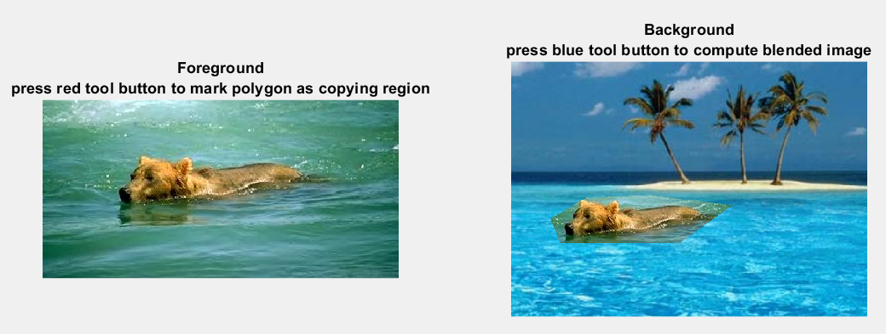
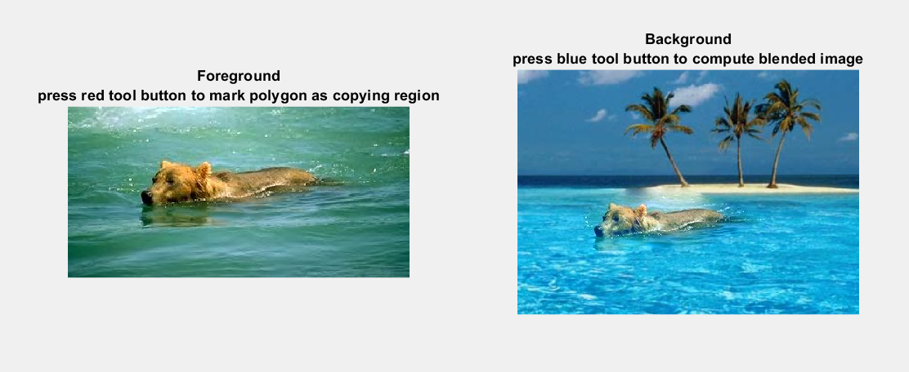

# Report

> Environment：Windows11 MATLAB R2021A

## 1 Introduction

基于泊松方程的图像融合，并实现实时用户交互

​	实现图形融合指：设映射函数 $f:(x,y)\rightarrow(R,G,B)$，那么如下图所示, $f$ 是定义域在 $\Omega$处的待融合图像, $f^*=f_B$是定义域为 $S$ 的背景图（background）, $g=f_F$ 是原来的原始图像(foreground)， 要解决的问题是让二者能自然的融合。

​	所谓自然融合，就是在保持原图像内部梯度(最小化新图与原图的梯度差异)的前提下，让粘贴后图像的边界值与新的背景图相同，以实现无缝粘贴的效果。

<div align="center">

</div>

## 2 Method

### 2.1 Poisson Image Editing

#### Mathematical Formation

​	从数学上讲，对于嵌入新背景待求的新图像 $f(x,y)$，背景图形为 $f_B(x,y)$和前景图像为 $f_F(x,y)$ ，而要解决的问题等价于解最优化问题：

$$
\min\limits_f \iint_\Omega \vert\nabla f-\nabla f_F \vert^2 \quad \mathrm{with} f\vert_{\partial \Omega}=f_B\vert_{\partial \Omega}\tag1
$$

​	利用变分法通过 Euler-Lagrange equation 可转化为具有Dirichlet边界条件的Poisson方程：

$$
\Delta f= \Delta  f_F\ \mathrm{over}\ \Omega \quad \mathrm{with} f\vert_{\partial \Omega}=f_B\vert_{\partial \Omega}
\tag2
$$

​	如果令 $\widetilde f=f-f_F$, $(f_B-f_F)=\varphi$那么该问题就可以转换成求解 Laplace 方程的边界问题：

$$
\Delta \widetilde f= 0\ \mathrm{over}\ \Omega \quad
\mathrm{with}\widetilde f\vert_{\partial \Omega}=(f^*-g)\vert_{\partial \Omega}=\varphi|_{\partial \Omega}\tag3
$$

这里的 $f_B, f_F, \varphi$都是已知的条件，而 $\widetilde f$ 是待求解的函数。

#### Numerical Equation

为了进行数值上的求解，则要对 $\Delta f$ 离散化处理，处理方式利用有限差分的形式，设像素点步长为 $h=1$ 对于 $S$区域内任意点 $\mathbf p=(i,j)$来说，该点对应 $f$ 值记作 $f_p$，那么有

$$
\Delta f(\mathbf p)\approx\frac{4f(i,j)-f(i+1,j)-f(i-1,j)-f(i,j+1)-f(i,j-1)}{4h^2}\tag4
$$

​	为了表达式的简单，定义 $N_p$ 为 $S$ 中的每一个像素 $p$四个方向连接邻域，令 $\langle p,q\rangle$ 为满足 $q\in N_p$ 的像素对，即 $q\in\{(i+1,j),(i-1,j),(i,j+1),(i,j-1)\}$，则可以得到数值方程解法

$$
\begin{equation}
		\mathrm{for}\ \mathrm{all}\ p\in \Omega,\ |N_p|\widetilde f_p-\sum\limits_{q\in N_p\cap \Omega} \widetilde f_q=\sum\limits_{q\in N_p\cap \partial \Omega}\varphi_p
	\end{equation}\tag5
$$

#### Algorithm

设 $\widetilde f_{ij}=u_{ij},\varphi_p=\varphi_{ij}$

$$
4u_{i,j}-u_{i,j-1}-u_{i-1,j}-u_{i+1,j}-u_{i,j+1}=0\quad(i,j)\in \Omega\backslash\partial\Omega\tag6
$$

$$
u_{k,l}=\varphi(k,l)\quad (k,l)\in\partial\Omega\tag7
$$


如果以矩形区域举例, $\Omega=\{(i,j)|0\le i\le m,0\le j\le m\}$

则对于上式一共有 $(m+1)\times (n+1)$个未知数 $u_{ij}$ ，公式（5）与公式（6）一共有 $(m+1)\times (n+1)$个约束条件，且这些条件线性无关，故是可解的。

对于更加一般的边界，算法描述如下

0. 初始化，设 $\Omega\backslash\partial\Omega$内的像素点共有 $N$ 个，建立 $N\times N$ 系数矩阵`sparse_mat=0`,以及代求N维待求向量 `vec` 。同时假设区域 $S$ 内公有 $n\times m$各像素点，从起始点出发。
1. 遍历区域 S 内的像素点（i,j）
2. 如果 $(i,j)\in\Omega\backslash\partial\Omega$，设`index(i,j) = sub2ind(i,j)`
   - `sparse_mat[index(i,j)][index(i,j)]= 4`
   - 如果 $(i,j)$周围的点 $\mathbf q\in \Omega\backslash\partial\Omega$,那么 `sparse_mat[index(i,j)][index(q)]=-1`
   - 如果 $(i,j)$周围的点 $\mathbf q\in \partial\Omega$,那么 `vec[index(q)]=`$\varphi$`[index(q)]`
   - 周围点 $\mathbf q$ 是指 $(i-1,j),(i+1,j),(i,j-1),(i,j+1)$
3. 求解方程 `sparse_mat` * `x`=`vec`, where `x(index(i,j)) = u(i,j)`.

最终解得 $\widetilde f_{ij}=u_{ij}$，得到最终图像的像素值为：

$$
f(i,j)=\widetilde f(i,j)+f_F(i,j)
$$

其中 $f_F(i,j)$ 为原来的前景图像的像素值，$\widetilde f(i,j)$ 为刚求解得到的值。

### 2.2 Boundary and Domain

​	为了能良好的确定边界，首先要待采样边界的范围，代码中采取的策略是：*将所选定义域限定在小范围矩形中*

```matlab
    %% preprocess.m
    %x_min,y_min 是区域左上角
    %x_max,y_max 是区域右下角
    width = x_max - x_min + 1;
    height = y_max - y_min + 1;
    source_start = [x_min, y_min];
```

​	当缩小了范围后，采用了 **MATLAB**的 `inpolygon` 函数来确定图像中的点是否在所设置的定义域内部，用 `mask` 来表示矩形中的点是否在边界内。

```matlab
    %% preprocess.m
    %确定定义域和边界
    mask = zeros(height, width);
    n = height * width;
    xv = source_points(:, 2);
    yv = source_points(:, 1);
    xq = reshape(meshgrid(1:height, 1:width)', 1, n) + source_start(2) - 1;
    yq = reshape(meshgrid(1:width, 1:height), 1, n) + source_start(1) - 1;
    [in, ~] = inpolygon(xq, yq, xv, yv);
    mask(in) = 1;%在矩形内部，则为1
    num_inside = sum(in); 
    inside_index = find(in);%所有内部点的索引
```

​	这样就可以很好的确定边界与定义域了。

### 2.3 Sparse Matrix

​	在预处理中，按照 **2.1 Algorithm** 的方法，构造的矩阵具有稀疏性，故采用了稀疏矩阵来表达矩阵，节省空间开销。同时构建矩阵只需要前景图像（原图）位置即可，可以重用稀疏矩阵，**实现实时 Poisson 图像融合。**

​	同时观察到矩阵是对称矩阵

$$
\text{sparseMat}(index(i,j))=\text{sparseMat}(index(j,i))
$$

故在预处理阶段采用 **Cholesky** 分解的方法，将矩阵分解为一个下三角矩阵L和其转置，那么在求解线性方程组时，也可以重用分解结果。

​	由于用户在实时移动图像时，移动过程是连续的，所以每次移动所解出的线性方程组的解差别不会很大，可以重用上次解的结果作为本次计算时解的初值，提高稀疏矩阵迭代求解的效率。

```matlab
    %%blendImagePoisson.m
    num_inside = sum(sum(mask));
    X = zeros(num_inside,3);
    tol = 1e-11; % 收敛容许误差
    maxit = 1000; % 最大迭代次数
    %X0 是上次求解的结果
    %L 是Cholesky预分解得到的下三角矩阵
    [X(:,1), ~, ~, ~] = pcg(spm, B(:,1), tol, maxit, L, L',X0(:,1));
    [X(:,2), ~, ~, ~] = pcg(spm, B(:,2), tol, maxit, L, L',X0(:,2));
    [X(:,3), ~, ~, ~] = pcg(spm, B(:,3), tol, maxit, L, L',X0(:,3));
    X0 = X;
    imret = blendImage(im1, im2, target_start, source_start, mask, X);
```

## 3 Result

### Normal Paste

<div align="center">

</div>

这只是简单拷贝

### Poisson Editing

实验结果如下：

<div align="center">

</div>

由图可见确实实现了图像的融合，效果很好

### 实时交互

在提供的程序中，可以实现用户拖动目标框，实时得到融合结果，这得益于矩阵重用的结果。

## 4 Summary

- 本次实验熟悉了 **MATLAB** 中稀疏矩阵用法，且利用矩阵预分解方法实现高效的交互操作
- 通过对 **Poisson Editing** 算法的学习，了解到保持图像梯度不变而改变偏移值，可以对图像融合产生良好的效果。在实验中也掌握了 $Laplace$ 方程数值解的方法

## 5 Appendix

本次实验，在已给框架中修改添加了一下函数：

- 修改 `blendImagePoisson.m` ，以实现图像融合的核心算法，内部包含两个函数
  - `getDiv` 函数，获取线性方程做 $Ax=b$ 中的右值 $b$
  - `blendImage` 函数，利用解出的 $x$，来对图像进行填充
- 修改 `toolPasteCB.m`、`toolMarkCB.m` ，实现传递中间变量，用户实时交互
- 创建 `preprocess.m` , 在用户第一次进行图像粘贴时，预分解矩阵和掩码图，以辅助加速实时交互效果的实现
