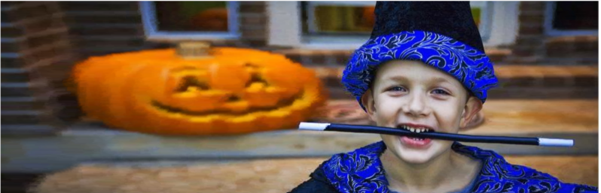

# Report

> Seam Carving

## 1. Assignment

​	用 C++实现 Seam Carving 算法：给定输入图片及指定目标图像尺寸，运行 Seam  Carving 算法，输出内容感知的缩放结果

## 2 Algorithm

​	为了在缩放图像时，实现内容感知，要做的是从图像中找到一条恰当的路径去增减图像以保证不破坏图像中重要的区域而对不重要的地方进行增减，如下图所示

<div align=center>
    
    <br>
    <div style = "
        color: orange;
        border-bottom: 1px solid #d9d9d9;
        display: inline-block;
        color: #999;
        padding: 2px;">
        Figure 1:Path
    </div>
    <p> </p>
</div>

### 2.1 Energy Image

#### Ideal situation

​	为了获取路径，首先必须区分如何图像中哪个区域为重要的要不能修改的，哪个区域不是显著的是可以修改的。在理想情况下，应该尽可能的保持人物脸部不变，所以有下图

<div align=center>
    
    <br>
    <div style = "
        color: orange;
        border-bottom: 1px solid #d9d9d9;
        display: inline-block;
        color: #999;
        padding: 2px;">
        Figure 2: Given Sailence
    </div>
    <p> </p>
</div>

​	按照上图所示，灰度值越大则越显著重要，不应该被修改

#### L1 Norm

​	按照文章[<sup>[1]</sup>](#refer-anchor-1) 所述，可以定义以图像梯度为度量的显著度，即

$$
e_1(\mathbf I)=|\frac\partial{\partial x}\mathbf I|+|\frac\partial{\partial y}\mathbf I|\tag1
$$

​	其中 $\mathbf I$ 是指图像中一点 $(i,j)$ 处的像素值，按照 $L_1$ 范数定义的显著度，可以得到以下图像

<div align=center>
    
    <br>
    <div style = "
        color: orange;
        border-bottom: 1px solid #d9d9d9;
        display: inline-block;
        color: #999;
        padding: 2px;">
        Figure 3: L1 Norm Sailence
    </div>
    <p> </p>
</div>

>
> 实现细节在代码 **“MyImage.h”**的`void saliencyL1Init()`中
>

#### Local-global single-scale saliency

​	此外，根据文章[<sup>[2]</sup>](#refer-anchor-2)，也可以按照每个像素点周围的补丁(patch)，来定义像素之间的差异，即

$$
d(p_i,p_j)=\frac{d_{color}(p_i,p_j)}{1+c\cdot d_{position}(p_i,p_j)}\tag2
$$

​	其中patch是指像素周围的点在中心点的像素平均, $c=3$ , $d_{color}$ 是 **CIE** 色域的像素欧式距离, $d_{positionn}$ 是patch之间的欧式距离，其被图像的长边归一化。

​	按照 eq(2) 的定义，可以得到每点之间的差异值，为了度量图像显著度，采取的策略是：对像素点 $i$ ，找到图像中前 $K=64$ 小的差异值 $d(p_i,p_j)$，如果前K小的差异值都足够大，那么则认为该像素点足够显著，不应该被修改。此时显著度定义为：

$$
e_i^r=1-\exp\{-\frac1K\sum_{k=1}^{K}d(p_i^r,q_k^r)\}\tag3
$$

​	其中 r 是用来标识patch的大小，根据此定义得到下图

<div align=center>
    
    <br>
    <div style = "
        color: orange;
        border-bottom: 1px solid #d9d9d9;
        display: inline-block;
        color: #999;
        padding: 2px;">
        Figure 4: Local-Gobal Sailence
    </div>
    <p> </p>
</div>

> 该图像是利用 Salience 文件夹中的代码生成的

### 2.2 Find Path

​	在给定了显著图像后，要找到一条显著度（能量）最小的路径，即

$$
s^* = \min_{\mathbf s} E(\mathbf s)=\min_{\mathbf s}\sum_i^n e(\mathbf I(s_i))\tag4
$$

其中 $\mathbf s$ 是一条路径，如果对于竖直路径，则有

$$
\mathbf s^{\mathbf x} = \{s_i^x\}_{i=1}^n=\{(x(i),i)\}\qquad s.t. \forall i,|x(i)-x(i-1)|\le1
$$

水平路径同理。以竖直路径为例，依照 eq(4) 可以利用**动态规划**的方法寻找路径，即

$$
M(i,j) = e(i,j)+\min\{M(i-1,j-1),M(i-1,j),M(i-1,j+1)\}
$$

其中 $M(i,j)$是从顶端某点到 $(i,j)$ 处的路径能量累计总和，在进行动态规划时要辅助记录每次路径选择的横坐标。

​	当 $j=n$ 时，从 $M(\cdot,n)$中找到能量最小的横坐标，然后回溯路径即可找到能量最小路径，路径结果如 图(1) 所示

### 2.3 Resize Image

设源图像为 $n\times m$ 的大小，现在调整为 $n'\times m'$ 大小

#### Reduce image size

假设只调整图像宽度，缩小图像的思路为：每次迭代都找一条路径来逐步缩小，直到达到目标宽度为止。伪代码如下：

```c
decreaseWidth(new_width)
	for i = 1 to width - new_width
        path = findPath(energy_image)
        for (i,j) in path
            erase pixel(i,j) in image
            erase energy(i,j) in energy_image
        end for
    end for
```

这种方式会使得每次缩小图像都在相同的不显著区域，不会影响到图像主体。结果如下
<div align=center>
    
    
    <br>
    <div style = "
        color: orange;
        border-bottom: 1px solid #d9d9d9;
        display: inline-block;
        color: #999;
        padding: 2px;">
        Figure 5: left,orign 500 &times; 324; right,400&times;324
    </div>
    <p> </p>
</div>

#### Enlarge image size

假设只调整图像宽度，如果任然按照缩小图像的思路来扩增图像，那么会造成每次都在相同路径处扩增图像，导致重影现象
<div align=center>
    
    <br>
    <div style = "
        color: orange;
        border-bottom: 1px solid #d9d9d9;
        display: inline-block;
        color: #999;
        padding: 2px;">
        Figure 6: Shadow 600&times;324
    </div>
    <p> </p>
</div>

​	为了解决这个问题，扩增图像的思路k可以按照文章[<sup>[1]</sup>](#refer-anchor-1) 给出的方式：在原始图像中找到 $k= m'-m$ 条 路径，这些路径能量是前 $k$ 小的，这样就避免了只在相同路径处反复复制导致重影，伪代码如下

```python
increaseWidth(new_width)
    for i = 1 to new_width - width
        path = findPath(energy_image)
        for (i,j) in path
            insert pixel(i,j) in image
            energy(i,j) = energy(i,j) + punish
        end for
    end for
```

​	伪代码中对原始的显著能量图进行了修改，增加 $energy(i,j)$的值使得其变得不再显著，保证在下次选择路径时可以选到别的路。

> **注**:之所以不采取直接根据 $M(i,j)$ 图来选择其他路径，是因为路径可能存在交叉现象，这样会导致在调整图像时，不利于图像扩增,像素位置错乱。

​	扩增后图像如下：
<div align=center>
    
    
    <br>
    <div style = "
        color: orange;
        border-bottom: 1px solid #d9d9d9;
        display: inline-block;
        color: #999;
        padding: 2px;">
        Figure 7: left,orign 500 &times; 324; right,600&times;324
    </div>
    <p> </p>
</div>

​	在实际代码中，为了防止因图像扩增过大而导致所有路径都复制一遍，那么这与简单的图形扩增没有区别，不符合我们对显著区域保护的要求，所以实际操作时可以根据新宽度 $m'$ 的大小来采取分段扩增图形的思路：

```cpp
int increase = new_width - width
while (increase > 32) {
	increaseWidth(increase / 4 * 3);
   	increase = increase - increase / 4 * 3;
}
increaseWidth(increase);  
```

得到图形如下：
<div align=center>
    
    <br>
    <div style = "
        color: orange;
        border-bottom: 1px solid #d9d9d9;
        display: inline-block;
        color: #999;
        padding: 2px;">
        Figure 8:1000&times;324
    </div>
    <p> </p>
</div>

## 3 Result

### 3.1 结果展示

对图像进行同比例的扩大或缩小后，得到下图

<div align=center>
    <div style="display: flex; justify-content: space-between; align-items: center;">
        <div style="display: flex; flex-direction: column; align-items: center; margin-right: 20px;">
            
            <span style="margin-top: 5px; font-size: 14px;"><b>Original:500&times;324</b></span>
        </div>
        <div style="display: flex; flex-direction: column; align-items: center; margin-right: 20px;">
            
            <span style="margin-top: 5px; font-size: 14px;"><b>Shrink:350&times;224</b></span>
        </div>
        <div style="display: flex; flex-direction: column; align-items: center;">
            
            <span style="margin-top: 5px; font-size: 14px;"><b>Enlarge:650&times;424</b></span>
        </div>
    </div>
    <br>
    <div style = "
        color: orange;
        border-bottom: 1px solid #d9d9d9;
        display: inline-block;
        color: #999;
        padding: 2px;">
        Figure 9: Result
    </div>
    <p> </p>
</div>

### 3.2 显著图对比

对三类中显著图像策略进行了对比，结果如下

<div STYLE="page-break-after: always;"></div>

<div align=center>
    <div style="display: flex; justify-content: space-between; align-items: center;">
        <div style="display: flex; flex-direction: column; align-items: center; margin-right: 20px;">
            
            <span style="margin-top: 5px; font-size: 14px;"><b>Given img</b></span>
        </div>
        <div style="display: flex; flex-direction: column; align-items: center; margin-right: 20px;">
            
            <span style="margin-top: 5px; font-size: 14px;"><b>L1 Norm</b></span>
        </div>
        <div style="display: flex; flex-direction: column; align-items: center;">
            
            <span style="margin-top: 5px; font-size: 14px;"><b>Local Global</b></span>
        </div>
    </div>
    <br>
    <div style = "
        color: orange;
        border-bottom: 1px solid #d9d9d9;
        display: inline-block;
        color: #999;
        padding: 2px;">
        Figure 10: Shrink Width 400&times;324
    </div>
    <p> </p>
</div>

<div align=center>
    <div style="display: flex; justify-content: space-between; align-items: center;">
        <div style="display: flex; flex-direction: column; align-items: center; margin-right: 20px;">
            
            <span style="margin-top: 5px; font-size: 14px;"><b>Given img</b></span>
        </div>
        <div style="display: flex; flex-direction: column; align-items: center; margin-right: 20px;">
            
            <span style="margin-top: 5px; font-size: 14px;"><b>L1 Norm</b></span>
        </div>
        <div style="display: flex; flex-direction: column; align-items: center;">
            
            <span style="margin-top: 5px; font-size: 14px;"><b>Local Global</b></span>
        </div>
    </div>
    <br>
    <div style = "
        color: orange;
        border-bottom: 1px solid #d9d9d9;
        display: inline-block;
        color: #999;
        padding: 2px;">
        Figure 11: Enlarge Height 500&times;374
    </div>
    <p> </p>
</div>

<div align=center>
    <div style="display: flex; justify-content: space-between; align-items: center;">
        <div style="display: flex; flex-direction: column; align-items: center; margin-right: 20px;">
            
            <span style="margin-top: 5px; font-size: 14px;"><b>Given img</b></span>
        </div>
        <div style="display: flex; flex-direction: column; align-items: center; margin-right: 20px;">
            
            <span style="margin-top: 5px; font-size: 14px;"><b>L1 Norm</b></span>
        </div>
        <div style="display: flex; flex-direction: column; align-items: center;">
            
            <span style="margin-top: 2px; font-size: 14px;"><b>Local Global</b></span>
        </div>
    </div>
    <br>
    <div style = "
        color: orange;
        border-bottom: 1px solid #d9d9d9;
        display: inline-block;
        color: #999;
        padding: 2px;">
        Figure 12: Enlarge Width 600&times;324
    </div>
    <p> </p>
</div>

- Given Map 的结果中的人物的脸的变形程度最小，这是因为在能量图中给人物的脸赋予了很高的能量，而 其它两种算法中人脸处的能量都是很低的。
- L1 Norm 的结果也对人物的脸进行了一定程度的保持，它的好处在于可以不用依赖于给定的能量图，也可以取得较好的效果。
- Local Global方法的结果对人物的脸保持较差，但它对于背景的南瓜头的形状保持的较好,主要还是由于该方法给定的能量图对脸部权重较小

<div STYLE="page-break-after: always;"></div>

### 3.3 GUI

<div align=center>
    
    <br>
    <div style = "
        color: orange;
        border-bottom: 1px solid #d9d9d9;
        display: inline-block;
        color: #999;
        padding: 2px;">
        Figure 13:GUI
    </div>
    <p> </p>
</div>


​	实验中调整了GUI设计，添加了控件，可以显示图像路径和选择三类显著图的方法操作

## 4 Summary

- 本次实验对于图像显著化内容有了更多的了解，对于图像像素化矩阵化操作
- 熟悉了C++面向对象语言，对用户GUI设计在C++上实现有了一定了解
- 掌握了动态规划方法寻找路径的方法


## 5 Reference


<div id="refer-anchor-1"></div>

- [1] [Seam Carving for Content-Aware Image Resizing](http://graphics.cs.cmu.edu/courses/15-463/2012_fall/hw/proj3-seamcarving/imret.pdf)

<div id="refer-anchor-1"></div>
- [2] [Context-Aware Saliency Detection](https://www.researchgate.net/publication/51925347_Context-Aware_Saliency_Detection)