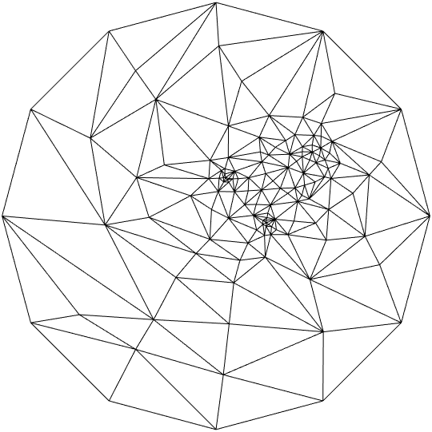
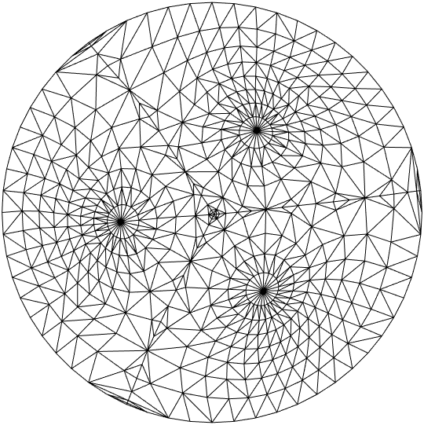

# Report

> Environment: MATLAB 2023a

## 1. Assignment

​	实现三维网格平面参数化，将类似图 1的三维网格参数化为二维网格。

<div align=center>
    
    <br>
    <div style = "
        color: orange;
        border-bottom: 1px solid #d9d9d9;
        display: inline-block;
        color: #999;
        padding: 2px;">
        Figure 1. Cat head
    </div>
    <p> </p>
</div>

## 2. Method

​	三维网格 $G_1(V,E)$ 参数化是将三维网格顶点映射到给定的二维平面 $G_2(V,E)$ ，满足：

- 维持点与点的连接关系
- 源网格的边界仍是目标网格的边界
- 在定义好的能量量函数前提下是能量函数最小化

以下是不同能量函数定义的方法

### 2.1 Tutte 参数化[<sup>[1]</sup>](#refer-anchor-1)

​	该方法是一种简单的权重，将平面网格顶点 $u_i,u_j$ 中每一条边看作弹簧，且弹簧劲度系数 $K$ 都相同，则网格总能量为：

$$
E=\sum_{e_i\in edges}\frac12K\Vert e_i \Vert^2=\sum_{(i,j)\in edges}\frac12K\Vert u_i-u_j \Vert^2\tag1
$$

​	能量最小的必要条件是：对每个点 $u_i$ 求导，导函数值为0，有下式

$$
\frac{\partial E}{\partial u_i}=\sum_{j\in N_i}K(u_i-u_j)=0\tag2\\
$$

​	整理一下有方程组

$$
|N_i|u_i = \sum_{j\in N_i}u_j\qquad i =1,2,3...,V\tag3
$$

其中 $N_i$为每个顶点邻点；$w_{i,i}=-|N_i|$为每个顶点的度,而其他权重为 $w_{ij}=1$(如果 j 是 i 邻居) 。

​	对于上述方程组，假设有M个点固定于**圆形边界**上，则方程的未知数化为 $V-M$ 个，此时可以将方程组转化成如下形式

$$
\left\{
\begin{aligned}
	&\sum_{j\in N_i}u_j-|N_i|u_i=0\qquad &if\quad u_i\notin Boundary\\
	&u_i = (\cos\theta_i,\sin\theta_j) \qquad &if\quad u_i \in Boundary
\end{aligned}
\right.
$$

通过求解下面的稀疏矩阵线性方程组可以得到最终平面坐标结果


### 2.2 离散保角映射 [<sup>[2]</sup>](#refer-anchor-2)

​	简单的映射没有充分用到源图的信息，Matthias Eck 等人提出的离散保角映射法，对把第 $i$ 个源图点 $v_i$ 映到平面点 $h(v_i)=u_i$ 的映射 h，取其能量函数为:
 
$$
E=\sum_{(i,j)\in edges}\frac12\kappa_{ij}\Vert u_i-u_j \Vert^2\tag4
$$

​	与 **2.1** 不同的是权重函数 $\kappa$ 的定义:

$$
\begin{equation}
	\kappa_{i,j} = \frac{L_{ik_1}^2+L_{jk_1}^2-L^2_{ij}}{A_{ijk_1}}+\frac{L_{ik_2}^2+L_{jk_2}^2-L^2_{ij}}{A_{ijk_2}}\tag5
\end{equation}
$$

其中 $L_{i,j}$ 表示源图中 $v_i,v_j$ 的欧拉距离，$A_{ijk}$ 表示源图中 $v_i,v_j,v_k$ 的三角形面积, $k_1,k_2$ 表示与点 $i,j$ 组成的三角形的相邻两点。

​	而三角形面积可以写作

$$
A_{ikj}=\frac12L_{ik}L_{jk}\sin\theta_{ikj}=\frac{L_{ik}L_{jk}}2\times{\sqrt{1-\left(\frac{L_{ik}^2+L_{jk}^2-L_{ij}^2}{2L_{ik}{L_{jk}}}\right)^2}}
$$

​	于是可以得到 **cot weights**

$$
\kappa_{ij}=\kappa_{ji}=4(\cot \beta_{k_1}+\cot\gamma_{k_2})\tag6
$$

<div align=center>
    
    <br>
    <div style = "
        color: orange;
        border-bottom: 1px solid #d9d9d9;
        display: inline-block;
        color: #999;
        padding: 2px;">
        Figure 2. cot weight
    </div>
    <p> </p>
</div>


Fig1.中的 $v,v_i,v_{i-1},v_{i+1}$ 分别对应了 eq5.中的 $v_i,v_j,v_{k_1},v_{k_2}$

​	能量最低时则有

$$
\sum_{j\in N_i}\kappa_{ij}(u_i-u_j)=0\tag7
$$

### 2.3 Floater保形映射[<sup>[1]</sup>](#refer-anchor-1)

​	由上面的两种方法可知,对于每个非边界顶点$u_i$，关于它与邻居结点构成的权重关系如下：

$$
\sum_{j\in N_i}w_{ij}(u_i-u_j)=0\tag8
$$

​	按照**保形映射**的要求，不仅仅保存了角度映射关系，并且保留了长度的关系，具体做法是：

​	先把源图中3D 顶点$v_i$映射到平面的点 $P_i$，将 $P_i$位于坐标原点，$P_i$的邻居结点 $ P _ { i, j } $  应当保角度比例、保长度地映射到该平面区域上，满足

$$
\vert P_{i,j}-P_i\vert=\vert v_{i,j}-v_{i}\vert\\
\ang(P_{i,k-1},P_{i},P_{k})=2\pi \ang(v_{i,k-1},v_i,v_{i,k})/\Theta_i\\
\Theta_i=\sum_{k\in N_i}\ang(v_{i,k-1},v_i,v_{i,k})\tag9
$$

<div align=center>
    
    <br>
    <div style = "
        color: orange;
        border-bottom: 1px solid #d9d9d9;
        display: inline-block;
        color: #999;
        padding: 2px;">
        Figure 3. P映射图
    </div>
    <p> </p>
</div>


​	根据以上构建的关系，可以方便求得 $P_i$ 相对邻居的重心权重，根据重心权重即可获得 $u_i$ 的权重矩阵，重心权重构建方法如下[<sup>[3]</sup>](#refer-anchor-3):

​	首先，对于每条$P_iP_{i,l}$直线，（$P_iP_{i,l}$代指所有$P_i$点与其邻居点的连线）都要寻找相邻的两个邻居顶点$P_{i,k-1}$和$P_{i,k}$，使得线段$P_{i,k-1}P_{i,k}$与直线$P_iP_{i,l}$相交，组成三角形$\triangle P_{i,l}P_{i,k-1}P_{i,k}$，并在此三角形中求得其中心顶点$P_i$的重心权重{a,b,c},分别对应$\{P_{i,l},P_{i,k-1},P_{i,k}\}$这三个顶点。

​	假设我们遍历到了某个中心顶点$P_i$,它有**4**个邻居顶点，分别是$P_{i,0},P_{i,1},P_{i,2},P_{i,3}$,那么我们就创建一个**4*4**的矩阵**Mu**，把遍历$P_iP_{i,l}$直线时，得到的权重{a,b,c},分别填到**Mu**的第l列的第 $l$ 行，第$k-1$行和第$k$行。然后按行求和得到个列向量**Sum_mu**,这样就得到了权重值 `w[i][j]=Sum_mu[j],w[i][i]=sum(Sum_mu[j])`

<div align=center>

</div>

​	得到了权重矩阵后就可以类似 **2.1** 的方法求解线性方程组得到映射点了。

## 3. Experiment

​	在实验中利用了已给定的函数 `readObj.m ` 获取源图的 $(V,F)$ 结构；利用了`findBoundary.m` 用于查找网格边界 $B$。

​	在两种方法的代码实现中，借助 $(V，F)$ 来构建 $(V,E)$ 的关系

```matlab
[B,~] = findBoundary(v,f);
edge_i = reshape(f',1,[]);
edge_j = reshape(f(:,[2,3,1])',1,[]);%1->2->3
```

​	利用 `edge_i`, `edge_j` 很快得到稀疏矩阵的坐标索引，点与点的连接关系

<div align=center>

</div>

### 3.1 uniform.m

在 `uniform.m` 中实现了 Tutte 参数化方法，主要是统计每个顶点的度数，然后就可以构造出稀疏矩阵进行计算

```matlab
[counts,~] = histcounts(edge_i,1:(n_v+1));
counts(B) = 1;%边界上的点可以直接赋值,在对角线上可以直接记为1
edges(:,any(edge_i==B')) = [];% remove boundary index
A_mat = sparse(edges(1,:),edges(2,:),-1,n_v,n_v)+ ...
        sparse(1:n_v,1:n_v,counts,n_v,n_v);
```

### 3.2 harmon.m

在 `harmon.m` 中实现了离散保角映射，与 `uniform.m` 不同的是关于稀疏矩阵各个位置的权重值不同，利用简单的三角函数关系可以构建出符合 **cot weight** 的权重图

```matlab
F%计算每条边长
l_ij = vecnorm(v(f(:,1),:)-v(f(:,2),:),2,2);
l_jk = vecnorm(v(f(:,2),:)-v(f(:,3),:),2,2);
l_ki = vecnorm(v(f(:,3),:)-v(f(:,1),:),2,2);
%计算三角形ijk中k的cos，cot值
cos_k = zeros(size(f));
cos_k(:,1) = (l_jk.^2+l_ki.^2-l_ij.^2)./(2*l_jk.*l_ki);
cos_k(:,2) = (l_ki.^2+l_ij.^2-l_jk.^2)./(2*l_ki.*l_ij);
cos_k(:,3) = (l_ij.^2+l_jk.^2-l_ki.^2)./(2*l_ij.*l_jk);

cot_k = cos_k./sqrt(1-cos_k.^2);
cot_k = reshape(cot_k',1,[]);

weight_mat = sparse(edge_i,edge_j,cot_k,n_v,n_v)+...
                sparse(edge_j,edge_i,cot_k,n_v,n_v);
weight_diag = full(sum(weight_mat,2));
```

### 3.3 floater.m

在floater.m中通过构建中心点与邻居点按照 **eq(9)** 的方式构建平面映射，从而获取权重函数。下面是获取一个顶点与其邻居权重系数的函数

```matlab
function weight = getWeight(pos,angle)
    s = size(pos,1);
    w_mat = zeros(s,s);
    for i = 1:s
        anti_angle = angle(i)+pi;%点对称
        if(anti_angle>2*pi)
            anti_angle = anti_angle - 2*pi;
        end
        k = find(angle>anti_angle,1);%判断三角形的三个点
        if(isempty(k))
            k=1;j=s;
        else
            j = k-1;
        end
        A = [pos(i,:),1;pos(j,:),1;pos(k,:),1]';%求解权重
        b = [0;0;1];
        uvw = A\b;
        w_mat([i,j,k],i) = uvw;
    end
    weight = sum(w_mat,2);
end
```

输入的 `pos` 坐标类似如下，`angle`是每个顶点相对**正x轴**的角度

<div align=center>
    
    <br>
    <div style = "
        color: orange;
        border-bottom: 1px solid #d9d9d9;
        display: inline-block;
        color: #999;
        padding: 2px;">
        Figure 4. 平面映射 
    </div>
    <p> </p>
</div>


## 4. Result

以下为三种方法参数化 `cathead.obj` 的结果

<div align=center>
    
    
   	
    <br>
    <div style = "
        color: orange;
        border-bottom: 1px solid #d9d9d9;
        display: inline-block;
        color: #999;
        padding: 2px;">
        Figure 5. Left: Tutte; Mid: Harmonic;Right:Floater
    </div>
    <p> </p>
</div>

​	对比三种方法：Tutte方法产生的图像效果与源图距离参数无关，平面网格较为集中。而离散保角映射考虑源图边与边之间的角度关系，在平面上保持了角度关系，平面网格映射顶点之间分布会更好。而Floater保形映射不仅考虑了角度的关系，而且考虑了顶点间的长度关系，所以会更加接近源图的三角形面片关系。

​	如果参数化 `balls.obj` 可以更加直观的看到不同参数化方法的差异

<div align=center>
    
    <br>
    <div style = "
        color: orange;
        border-bottom: 1px solid #d9d9d9;
        display: inline-block;
        color: #999;
        padding: 2px;">
        Figure 6. Balls 
    </div>
    <p> </p>
</div>

<div align=center>
    
    
   	
    <br>
    <div style = "
        color: orange;
        border-bottom: 1px solid #d9d9d9;
        display: inline-block;
        color: #999;
        padding: 2px;">
        Figure 7. Left: Tutte; Mid: Harmonic;Right:Floater
    </div>
    <p> </p>
</div>
​		从图中可以看到，均匀权重法只能简单的映射到平面，不具有角度和长度的保持；而Harmoic方法较好的保持了球面中圆形的形状；但是可以看到 **Figure7.Mid** 图像中心位置处面片出现了翻转，这是由于三角形面片的夹角超过 $\pi/2$，这导致了 $\cot$ 权重法出现了 **负权重**；最后的保形映射很好了的保持了原图的形状同时避免了负权重的问题。

## 5. Summary

- 掌握了将三维图形二维映射到固定边界平面网格的参数化方法；
- 对比了三种不同参数化方法，认识到保角保形映射的优越性，要尽量的保持源图的信息才能得到较好的映射。


## 6. Reference

<div id="refer-anchor-1"></div>

- [1] [Floater. Parametrization and smooth approximation of surface triangulations. CAGD1997](https://www.cs.jhu.edu/~misha/Fall09/Floater97.pdf)

<div id="refer-anchor-1"></div>

- [2] [Eck, M., DeRose, T., Duchamp, T., Hoppe, H., Lounsbery, M., and Stuelze, W., “Mul- tiresolution analysis of arbitrary meshes,” 173–183 (1995).](https://sites.stat.washington.edu/wxs/Siggraph-95/siggraph95.pdf)

<div id="refer-anchor-3"></div>

- [3] [games301曲面参数化 作业1讲解 Floater权重Tutte’s参数化](https://blog.csdn.net/lifesize/article/details/127526985)