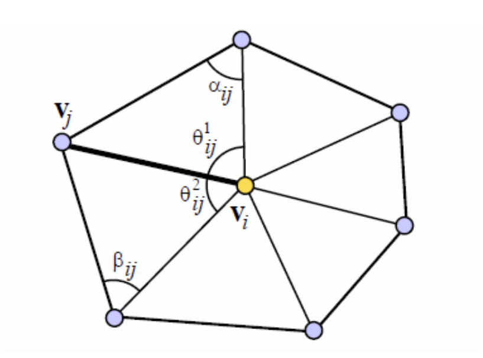
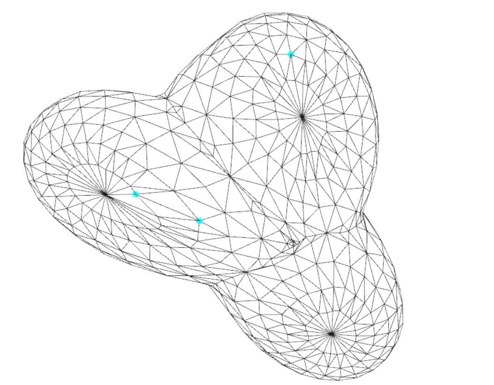
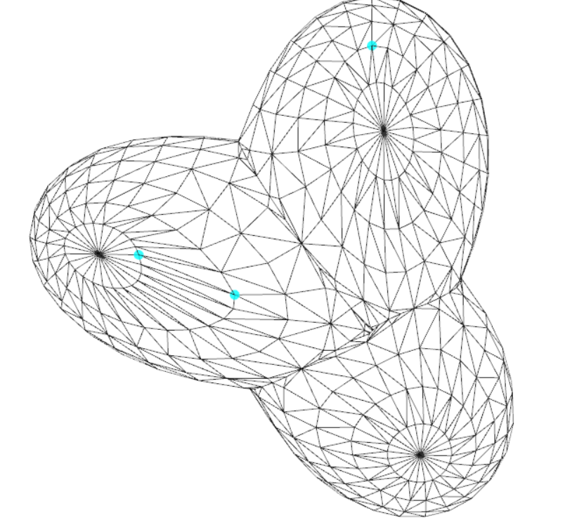

# Report

> Laplacian mesh editing
>
> Environment: C++, MATLAB2023R, Windows 11

## 1. Assignment

在 **C++和MATLAB**环境共同上实现三维网格平面参数化，能够实现在C++中调用matlab脚本实现指定功能，进行C++和MATLAB之间的数据交互，对下图的顶点进行保持 Laplace 坐标的拉动。图形界面说明：

- 拉动顶点可直接在网格中选中拉动，交互是实时的；更换 Laplace 矩阵方法
- 按下 `Change mode` 按钮，每按一次在均匀权重和 cot 权重中切换一次，初始为均匀权重
- 按下 `Load Obj` 按钮加载任意obj文件

<div align="center">
    
    <br>
    <div style = "
        color: orange;
        border-bottom: 1px solid #d9d9d9;
        display: inline-block;
        color: #999;
        padding: 2px;">
        Figure 1. 操作界面
    </div>
    <p> </p>
</div>

## 2. Method

### 2.1 Laplace坐标

Laplace坐标是指顶 $v_i$ 与周围1领域顶点加权平均点的差值向量，所描述的是点 $v_i$ 局部信息

<div align="center">
    
    <br>
    <div style = "
        color: orange;
        border-bottom: 1px solid #d9d9d9;
        display: inline-block;
        color: #999;
        padding: 2px;">
        Figure 2. Laplace coordinate
    </div>
    <p> </p>
</div>


数学描述为：

$$
\delta_i=v_i-\sum_{j\in N(i)}w_{ij}v_j\\
\sum_{j\in N(i)} w_{ij}=1
$$

对于不同的权重方法， $w_{ij}$的构造方法不同。

#### 均匀权重

均匀权重即每个 $w_{ij}$都相同，那么得到

$$
w_{ij}=\frac1{\vert N \vert}
$$

#### Cotangent 权重

Cotangent 权重能够近似的保角，对于 $w_{ij}$ 由两边的对角cot角度指得到

$$
w_{ij}=\cot{\alpha_{ij}}+\cot{\beta_{ij}}\\
w_{ij}= \frac{w_{ij}}{\sum_j{w_{ij}}}
$$

<div align="center">
    
    <br>
    <div style = "
        color: orange;
        border-bottom: 1px solid #d9d9d9;
        display: inline-block;
        color: #999;
        padding: 2px;">
        Figure 3. Cotangent Weight
    </div>
    <p> </p>
</div>


### 2.2 基于Laplace 坐标的网格编辑

算法的思想在于拉动点的过程中，保持网格各点的 Laplace坐标不变，即保持了源图的局部信息，假设构造的Laplace矩阵为 $L$，对应各点的Laplace坐标是 $\boldsymbol  \delta$,原始坐标为 $\boldsymbol x$

$$
L\boldsymbol x=\boldsymbol\delta
$$

当用户希望对源图中的 $x^{(k_1)},x^{(k_2)}\cdots x^{(k_m)}$，进行移动到 $z^{(k_1)},z^{(k_2)}\cdots z^{(k_m)}$ 。

那么其他的点要进移动变化，变化到 $\bold y$。在变换过程中要尽量满足 $\boldsymbol \delta$ 不变，且接近目标位置 $y^{(k_i)}= z^{(k_i)}$ ,即有下式，其中 $\lambda$为软约束系数，本实验设置为 $10^5$

$$
\min\left\{\sum_i||\delta_i-Ly_{i}||^2+\lambda\sum_k||y_k-z_k||^2 \right\}
$$

这可以等价的约束为求解线性方程组

$$
\begin{pmatrix} L\\I_k \end{pmatrix}Y=\begin{pmatrix} \delta\\z_k \end{pmatrix}\\
$$

$$
AY=b
$$

由于方程个数大于变量个数，此时可以按照最小二乘法的方法求解该线性方程组

$$
A^TAY=A^Tb
$$


## 3 Code

实现细节

- **main_wm.cpp** 中图形化用户操作界面，并将数据传入 **laplacian_mesh_editing.m** 文件

- **laplacian_mesh_editing.m** 文件接受顶点、面点信息和图形扭曲移动点信息，计算线性方程组，输出变换后的各个坐标

  ```matlab
  nv = size(x, 1);
  nf = size(t, 1);
  nP = size(P2PVtxIds,1);
  if(isCot)
      Laplace_mat = cotangent(x,t);
  else
      Laplace_mat = uniform(x,t);
  end
  delta = Laplace_mat*x;
  lambda = 1e5;
  I_ids = sparse(1:nP,P2PVtxIds,lambda,nP,nv);
  A = vertcat(Laplace_mat,I_ids);
  b = vertcat(delta,lambda*double(p2pDsts));
  b = transpose(A)*b;
  A = transpose(A)*A;
  y = A\full(b);
  ```

- **uniform.m** 文件实现均匀权重的Laplace 变换矩阵(和作业5类似)

- **cotangent.m** 文件实现cot权重的Laplace 变换矩阵

  ```matlab
  edge_i = reshape(f',1,[]);
  edge_j = reshape(f(:,[2,3,1])',1,[]);%1->2->3
  %计算每条边长
  l(:,1) = vecnorm(v(f(:,1),:)-v(f(:,2),:),2,2);
  l(:,2) = vecnorm(v(f(:,2),:)-v(f(:,3),:),2,2);
  l(:,3) = vecnorm(v(f(:,3),:)-v(f(:,1),:),2,2);
  %计算三角形ijk中k的cos，cot值
  cos_k = zeros(size(f));
  cos_k(:,1) = (l(:,2).^2+l(:,3).^2-l(:,1).^2)./(2*l(:,2).*l(:,3));
  cos_k(:,2) = (l(:,3).^2+l(:,1).^2-l(:,2).^2)./(2*l(:,3).*l(:,1));
  cos_k(:,3) = (l(:,1).^2+l(:,2).^2-l(:,3).^2)./(2*l(:,1).*l(:,2));
  cot_k = cos_k./sqrt(1-cos_k.^2);
  
  cot_k = reshape(cot_k',1,[]);
  %计算ij的权重函数
  weight_mat = sparse(edge_i,edge_j,cot_k,nv,nv)+...
                  sparse(edge_j,edge_i,cot_k,nv,nv);
  weight_diag = full(sum(weight_mat,2));
  ```


## 4 Result

由图可见，得到以下结果

<div align="center">
    
   	
    <br>
    <div style = "
        color: orange;
        border-bottom: 1px solid #d9d9d9;
        display: inline-block;
        color: #999;
        padding: 2px;">
        Figure 4.Result:left Uniform; right: Cotangent
    </div>
    <p> </p>
</div>

同样的扭曲，cotangent权重效果更好，通过内圈圆可以看出，其保持了部分图形原有的形状

## 5 Summary

本次实验了解了Laplace坐标的概念，并通过Laplace坐标保持了图形扭曲变形后局部的保形操作，对图形几何处理有了更加深刻的认识。

## 6 Appendix

how to use this code:
1. make sure that the current path in Matlab points to this folder
2. build the glvu.sln project. Run or debug from visual studio
3. if you don't register COM in MATLAB, you can follow the steps below:

<div align="center">
    
    <p> </p>
</div>
