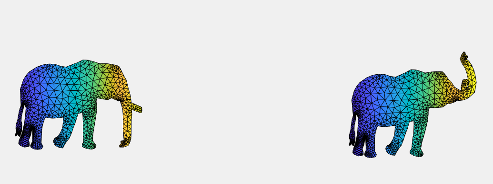
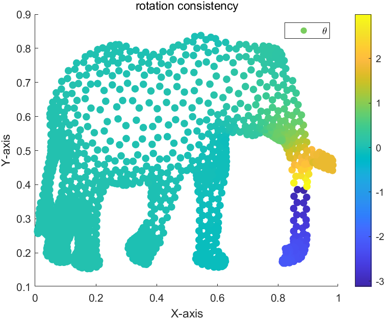
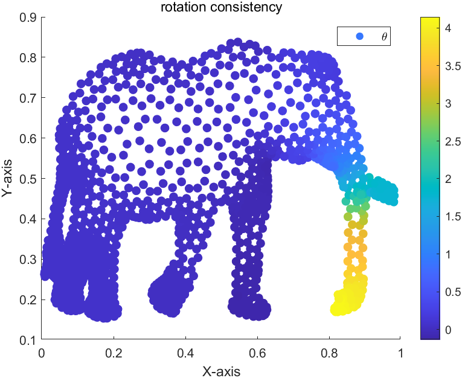

# Report

> ARAP 插值算法 王润泽
>
> Environment: MATLAB2023R, Windows 11

## 1. Assignment

在MATLAB上实现二维 As-Rigid-As-Possible 形状插值算法，实现图像动画的平滑过渡



## 2. Method

在ARAP[<sup>[1]</sup>](#refer-anchor-1)插值中，我们希望在两个图像之间创建平滑的过渡，同时保持局部刚性。而图像中的变化可以一一对应到每个三角片元 $\text{triangle}$ 的变换，变换矩阵为 $M_i$，那么从源图到目标图像的平滑过渡时的中间过渡矩阵 $M_i(t)$ 为线性插值
$$
M_i(t) = (1-t)\times I+t\times M_i
$$

### 2.1 过渡矩阵的构造

以其中一个三角形面元 $t_i$ 为例，在二维网格上，其每个顶点满足 $\bf x\in \R^{2\times1}$ ,假设 $t_i$ 变换前顶点坐标为 $(\bf{x_1},\bf{x_2},\bf{x_3})$, 变换后顶点坐标为 $(\bf{y_1},\bf{y_2},\bf{y_3})$,于是最终的矩阵 $M$ 满足
$$
M\bf [x_1,x_2,x_3]=[y_1,y_2,y_3]
$$
显然自由度存在冗余，因为 $\bf{x_1+x_2=x_3}$，故可以得到
$$
M=\bf{[y_1,y_2]*[x_1,x_2]^{-1}}
$$
矩阵的变换主要由旋转 $R$，伸缩 $S$，平移 $T$，而变换矩阵 $M_i$ 主要由旋转和伸缩部分组成，即
$$
M=RS
$$
可以分解 $M$ 得到 $R$、$S$ 矩阵，常见的分解方法是 svd分解
$$
svd(M) = US^{0}V'\\
R=UV'\\
S = VS^0V'
$$
 一般地，伸缩变换是直接用线性插值就可以得到平滑过渡
$$
S(t)=(1-t)\times I+t\times S
$$
而旋转矩阵往往通过插值其中的 $\theta$ 参量来实现插值
$$
R(\theta)=\begin{pmatrix}
\cos \theta&-\sin\theta\\
\sin\theta&\cos\theta
\end{pmatrix}\\
R(t|\theta)=R(\theta*t)
$$
按照上面的方式就得到了在 t 时刻的过渡矩阵
$$
M(t)=R(t|\theta)*S(t)
$$

### 2.2 最小二乘求解目标

考虑整个图形由 $n$ 个顶点 $V$ 和 $m$ 条边 $E$ 构成，而变换矩阵直接操作的是图形的边，所以需要矩阵来转化，设有一矩阵 $D\in  \R^{m\times n}$,将顶点值 $V$ 转化到边向量 $E$ ，即
$$
D*V=E
$$
那么在对各个边进行变换后会得到如下情况


为了重新复原出每个顶点的位置，需要进行求解线性通过变换后的 $E(t)$，得到顶点 $V(t)$，而由于 $D$ 矩阵构成的矩阵条件个数超过变量个数，故采取最小二乘法构造
$$
D'D*V=D'*E
$$

### 2.3 旋转一致性[<sup>[2]</sup>](#refer-anchor-2)

所谓旋转不一致，主要是由于计算角度时的矩阵的旋转角 $\theta\in[0,2\pi]$，相邻角度变化差异过大容易造成不一致现象，即：
$$
|\theta_i-\theta_k|>\pi
$$


那么可能就会导致视觉上产生两个三角形面元旋转的方向相反的可能。要做的处理是让相邻的三角形面元的旋转角度差别不超过 $\pi$，使得 $\theta$ 能够连续变化

```matlab
while theta(i) - theta(j) > pi
      theta(i) = theta(j)+2*pi;
end
while theta(i) - theta(j) < -pi
      theta(j) = theta(j)-2*pi;
end
```



### 3. Code

在代码实现细节上，主要有构造一些稀疏矩阵来辅助点、边、面的之间的查找

- `e2t_idx` 利用边索引的方向来确定边所属的面元索引值

  ```matlab
  e2t_value = repmat(1:nt,3,1);
  e2t_value = reshape(e2t_value,1,[]);
  e2t_idx = full(sparse(edges(1,:),edges(2,:),e2t_value,nv,nt));%通过有向边找所在面
  ```

- 寻找相邻三角形

  ```Matlab
  t_adj = zeros(1,3);
  %如果边1->2所在三角形为A,
  %那么2->1所在三角形B，与A相邻
  t_adj(1) = e2t(t_head(2),t_head(1));
  t_adj(2) = e2t(t_head(3),t_head(2));
  t_adj(3) = e2t(t_head(1),t_head(3));
  t_adj = t_adj(t_adj ~=0);
  ```

- `v2e_value` 利用顶点的值来获取对应边相邻的值,对应的是**2.2** 中的矩阵 $D$

  ```matlab
  weight = ones(1,nt);
  v2e_i = reshape(repmat(1:2*nt,2,1),1,[]);
  v2e_j = reshape([[t(:,1),t(:,2)]';[t(:,2),t(:,3)]'],1,[]);
  v2e_v = repmat(reshape([weight;-weight],1,[]),1,2);
  v2e_value = sparse(v2e_i,v2e_j,v2e_v,nt*2,nv);
  edge_sor = full(v2e_value*x); edge_tar = full(v2e_value*y);
  ```

- 利用队列的方式，扩散式广度优先方法查找所有面元

## 4. Result

##### 旋转不一致的ARAP插值


##### 旋转一致性的ARAP插值


## 5. Summary

​	本次实验主要利用了 **ARAP** 插值算法来实现相似图像间的连续插值问题，对通过 **SVD** 分解找到图形的旋转与缩放矩阵，利用插值的方法得到过渡矩阵，并利用了广度优先查找相邻面元的方式解决旋转不一致问题，最终得到了良好的插值图像。

​	通过对三角面元数据结构的构造与重组，解决了利用顶点坐标获取边向量坐标，查找相邻面元的方式。

## 6.Reference

<div id="refer-anchor-1"></div>

[1] [M. Alexa et al. As-Rigid-As-Possible Shape Interpolation. SIGGRAPH 2000](http://www.cs.tau.ac.il/~levin/arap.pdf)

<div id="refer-anchor-2"></div>

[2] [Baxter et al. Rigid shape interpolation using normal equations. Symposium on Non-
photorealistic animation and rendering 2008](https://www.billbaxter.com/publications/Baxter-RigidMorphing-NPAR08.pdf)

