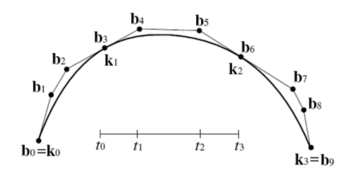
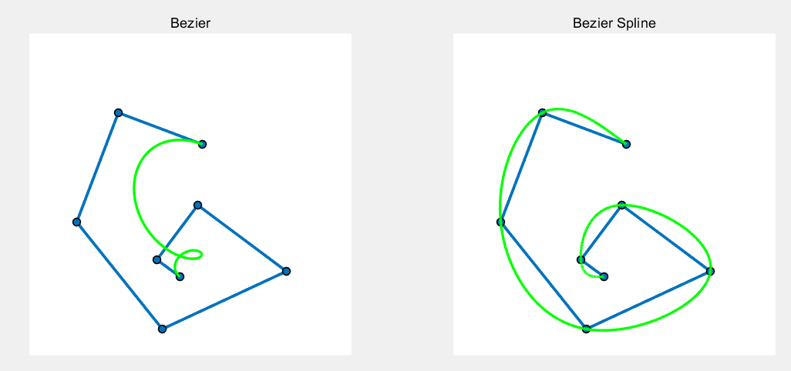

# Bézier Curve

> Environment: MATLAB R2023a

## 1. Assignment

实现 Bézier 曲线绘制: 给定指定点，进行光滑的插值拟合

## 2. Algorithm

### 2.1  Bernstein 基函数法

代码是基于 Bernstein 基函数的方法，对用户指定的输入点 $\{\mathbf b_i\}_{i=0}^n,b_i\in R^{1\times2}$ 构造关于时间 $t$ 的函数

$$
\mathbf x(t) = \sum_{i=0}^nC_n^i(1-t)^it^{n-i}\mathbf b_i
$$

上式可以转化成对离散时间参数序列 $\{t_k\}_{k=0}^m,t_k\in(0,1)$ 构造矩阵运算，矩阵 $M$ 是一个 $m\times n$ 的矩阵，下式是矩阵的第 $k$ 行

$$
M(t_k,:) = \begin{bmatrix} C_n^0t_k^n, & C_n^1t_k^{n-1}(1-t), &...& C_n^{n-1}t_k(1-t)^{n-1}, & C_n^n(1-t)^n \end{bmatrix}
$$

矩阵 $M$ 与输入点 $\{\mathbf b_i\}_{i=0}^n$ 无关，可以通过预计算获得，不必重复构造。

那么获取曲线 $\mathbf x$ 关于参数 $t$ 的方程为

$$
\mathbf x = M\mathbf b
$$

### 2.2 Bézier Spline

​	三次 Bézier 样条曲线的构造方法则是要求曲线精确经过指定点，而且满足整体曲线是 $C^2$
的。这时可以利用三次样条插值的方法进行计算。

考虑到 Bézier 曲线在边界处的导函数具有如下性质

$$
\mathbf x'(t=0)=n(\mathbf b_1-\mathbf b_0), \\\mathbf x'(t=1)=n(\mathbf b_n-\mathbf b_{n-1})
$$

$$
\mathbf x''(t=0)={n(n-1)(\mathbf b_0-2 \mathbf b_{1}+\mathbf b_{2})},\\\mathbf x''(t=1)={n(n-1)(\mathbf b_{n-2}-2 \mathbf b_{n-1}+\mathbf b_{n})}
$$

那么只要为了实现样条曲线，需要在给点区间内，构造辅助点，使得在指定点 $\mathbf b_i$ 处曲线是$C^2$
连续的，如下图所示

<div align="center">
    
    <br>
    <div style = "
        color: orange;
        border-bottom: 1px solid #d9d9d9;
        display: inline-block;
        color: #999;
        padding: 2px;">
        Figure 1.Example, 图中的k是文章中的输入点b, 图中的b是文字的辅助点p
    </div>
    <p> </p>
</div>


假设输入点是： $\{\mathbf b_i\}_{i=0}^n$，需要的构造的点为 $\{\mathbf p_i\}_{i=0}^{3n}$,假设时间序列是均匀的，那么则要满足以下 $3n+1$个方程

##### $C^0$ continuity

$$
p_{3k} = b_k\quad k=0,1,2,...,n
$$

##### $C^1 $continuity

$$
p_{i}-p_{i-1} = p_{i+1}-p_{i}\quad i=3,6,9,....,3(n-1)
$$

##### $C^2 $ continuity

$$
p_{i}-2p_{i-1}+p_{i-2} = p_{i+2}-2p_{i+1}+p_i\quad i=3,6,9,....,3(n-1)
$$

##### Boundary

$$
p_1 = \frac{b_2+b_0}{2}\\
p_{3n-1} = \frac{b_{3n-2}+b_{3n}}{2}
$$

在具体实现上，考虑到当指定点个数 $n+1$ 固定后，$\{\mathbf p_i\}_{i=0}^{3n}$ 与 $\{\mathbf b_i\}_{i=0}^n$ 的系数转换矩阵 $T$是固定的 $(3n+1)\times(3n+1)$的矩阵 ，也可以通过预计算和预分解的方式，避免重复计算。

$$
T\mathbf p =\begin{pmatrix}\mathbf b\\0\\.\\.\\.\\0 \end{pmatrix}_{(3n+1)\times2} 
$$

在获取到 $\{\mathbf p_i\}_{i=0}^{3n}$ 后，即可按照 **2.1** 的方法，构造一个4个指定点的插值曲线，其中矩阵 $M\in{R^{m\times4}}$ ,按照图1所示的方式，将各段曲线连接起来即可得到三次 Bézier 样条曲线。

<div STYLE="page-break-after: always;"></div>

## 3. Code

### 3.1 Framework

代码中是利用了 `drawpolyline` 的句柄，来实时监听 `addlistener` 点的移动或者选择，从而实现用户实时对点的操作的

```matlab
figure('Units', 'pixel', 'Position', [100,100,1000,700], 'toolbar', 'none');
canvas = ones(200, 200, 3);
ax1 = subplot(121);imshow(canvas);title("Bezier");
ax1 = subplot(122);imshow(canvas);title("Bezier Spline");
h_ploy = drawpolyline(ax1);
h_ploy_s = drawpolyline(ax2,'Position',h_ploy.Position);
hcurve = plot(ax1,bezier(h_ploy.Position,base_mat), 'g', 'linewidth', 2);
hcurve_s = plot(ax2,bezier_spline(h_ploy.Position,base4_mat,spline_mat), 'g', 'linewidth', 2);
h_ploy.addlistener('MovingROI', @(h, evt) bezier(evt.CurrentPosition,base_mat, hcurve));
h_ploy.addlistener('MovingROI', @(h, evt) bezier_spline(evt.CurrentPosition,base4_mat,spline_mat, hcurve_s,h_ploy_s));
```

### 3.2 预计算

在 `computeBaseMat.m` 和 `computeSplineMat.m` 中实现了对Bernstein 基函数矩阵和辅助点构造的矩阵的预计算

```cpp
function base_mat = computeBaseMat(nt,np)
%输入: 时间序列点数nt,控制点个数np
%输出: Bernstein 基函数矩阵
    base = zeros(1,np);
    for i=1:np
        base(i)=nchoosek(np-1, i-1);
    end
    base_mat = zeros(nt,np);    
    for i = 1:nt
        t = (i-1)/nt;
        base_mat(i,:) = (1-t).^(np-1:-1:0).*((t).^(0:1:np-1)).*base;
    end
end
```

```matlab
function spline_mat  = computeSplineMat(np)
%input: 控制点个数np
%output: 样条辅助点转换矩阵
    %C0连续
    n = (np-1)*3+1;n_index = np;
    index_unity = (1:3:n)';val_unity = ones(np,1);index_x = (1:np)';
    %C1连续
    n_C1 = 3*(np-2);
    index_C1 = zeros(n_C1,1);val_C1 = zeros(n_C1,1);coff_C1 = [1,-2,1];
    for i=1:3
        index_C1(i:3:n_C1) = i+2:3:n-2;val_C1(i:3:n_C1) = coff_C1(i);
    end
    temp = repmat(1+n_index:np-2+n_index,3,1);
    index_x = [index_x;reshape(temp,[],1)];n_index = n_index+(np-2) ;
    %C2连续
    n_C2 = 5*(np-2);
    index_C2 = zeros(n_C2,1);val_C2 = zeros(n_C2,1);coff_C2 = [-1,2,0,-2,1];
    for i=1:5
        index_C2(i:5:n_C2) = i+1:3:n-6+i;val_C2(i:5:n_C2) = coff_C2(i);
    end
    index_C2(3:5:n_C2) = [];
    val_C2(3:5:n_C2) = [];
    n_C2 = 4*(np-2);
    temp = repmat(1+n_index:np-2+n_index,4,1);
    index_x = [index_x;reshape(temp,[],1)];n_index = n_index + (np-2);
    %边界条件
    n_bound = 6;
    index_bound = [1,2,3,n-2,n-1,n]';val_bound = [1,-2,1,1,-2,1]';
    temp = repmat(1+n_index:2+n_index,3,1);
    index_x = [index_x;reshape(temp,[],1)];n_index = n_index + 2;
    %构造稀疏矩阵
    index_y = [index_unity;index_C1;index_C2;index_bound];
    val = [val_unity;val_C1;val_C2;val_bound];
    spline_mat = sparse(index_x,index_y,val,n,n);
    %预分解
    spline_mat = decomposition(spline_mat);
end
```

## 4. Result

<div align="center">
    
    <br>
    <div style = "
        color: orange;
        border-bottom: 1px solid #d9d9d9;
        display: inline-block;
        color: #999;
        padding: 2px;">
        Figure 2.Result
    </div>
    <p> </p>
</div>

该框架支持对点的平移和旋转，从图中可以看到样条曲线很好的经过了所有指定点，且具有良好的光滑性。

