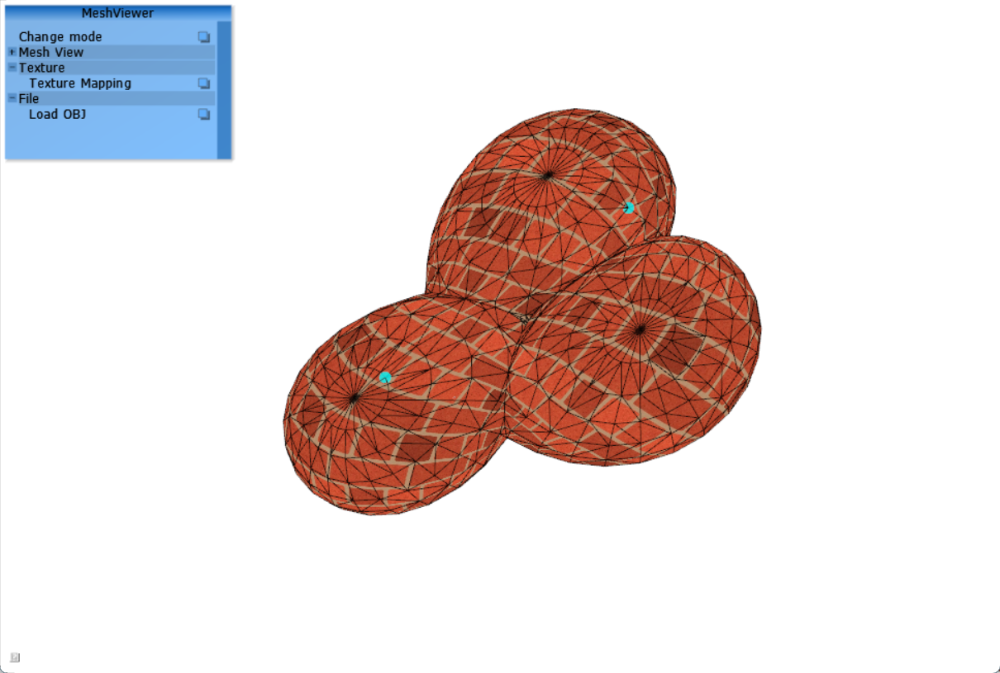
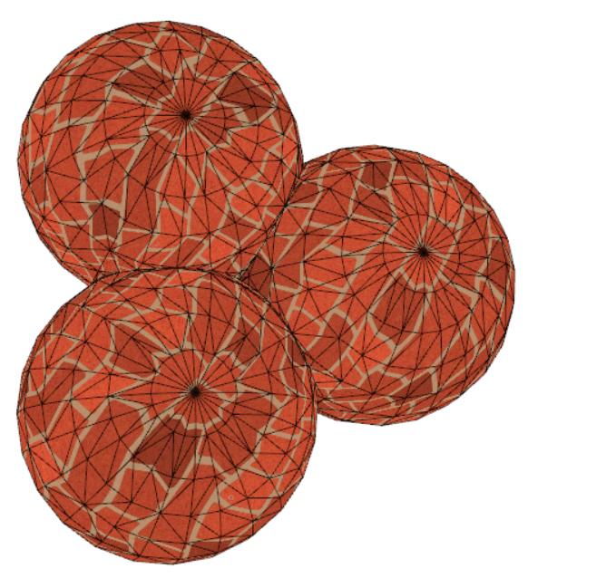
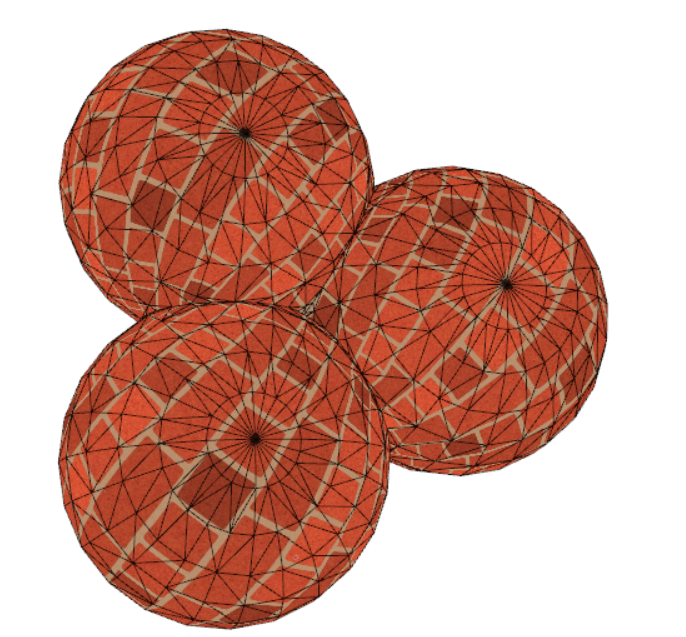

# Texture Mapping

> Environment: Windows11, Visual Studio 2022, MATLAB R2023a

## 1. Assignment

用 OpenGL 实现纹理映射

- 用 [05_parameterization](../05_parameterization/) 中参数化结果作为纹理坐标(u,v)，可以预计算，也可在线计算
- 以 **bricks2.png** 图像作为纹理，给三角网格贴上纹理

## 2. Code

在C++和MATLAB上处理顶点和面信息，具体来说是从C++中读取obj信息，将顶点坐标 `x` 和面与顶点索引信息 `t` 传入 **MATLAB** 中，运行 `parameterization.m` 脚本，得到参数化的坐标 `uv`

在实验中采用了两种参数化方法 `uniform_mapping.m` ，`cot_mapping.m`并进行了对比。

在C++代码中，主要函数实现在 `void textureMapping()` 函数中，

```cpp
//添加图形类
MyImage img(std::string("bricks2.png"), 4);
void textureMapping() {
    using namespace Eigen;
    //运行matlab脚本
    matlabEval("parameterization;");   // TODO: finish the script
    Matrix<float, Dynamic, Dynamic, RowMajor> uv_mat;
    matlab2eigen("single(uv)", uv_mat, true);
    int c = uv_mat.cols();
    int r = uv_mat.rows();
    uv.resize(c*r);
    for (int i = 0; i < r; i++) {
        for (int j = 0; j < c; j++)
			uv[i*c + j] = uv_mat(i, j)*4;//利用重复映射模式，让贴图显式更加密集
	}
    M.upload(x.data(), x.size() / 3, f.data(), f.size() / 3, uv.data());
    M.tex.setImage(img);
}
```

<div STYLE="page-break-after:always;"></div>

## 3. Result

#### 用户界面框架

<center>
    
    <br>
    <div style = "
        color: orange;
        border-bottom: 1px solid #d9d9d9;
        display: inline-block;
        color: #999;
        padding: 2px;">
        Figure 1.
    </div>
    <p> </p>
</center>

由于作业是延续了作业6中Laplace变换的框架，所以可以同时处理纹理贴图和图形变形

#### 对比

<center>
    
    
    <br>
    <div style = "
        color: orange;
        border-bottom: 1px solid #d9d9d9;
        display: inline-block;
        color: #999;
        padding: 2px;">
        Figure 2. Left: Uniform;Right:Cotangent
    </div>
    <p> </p>
</center>

通过对比可以看到，cotangent权重更好的保持了角度的映射，贴图的纹理效果更好