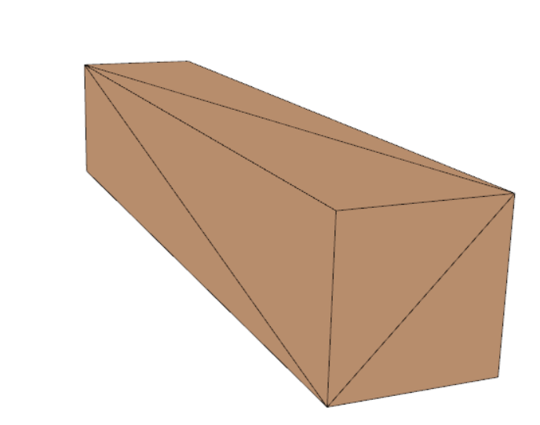

# Projection

> Environment: Windows11, Visual Studio 2022, MATLAB R2023a

## 1. Assignment

实现平行投影。

在 [Texture Mapping](../09_texture_mapping) 的框架下进行修改，将三维投影由透视投影改为平行投影。

## 2. Principle

所谓三维投影就是顶点着色器坐标变换的最后一步，相机空间的物体变换到裁剪空间中。

在一个顶点着色器运行的最后，OpenGL期望所有的坐标都能落在一个特定的范围内，且任何在这个范围之外的点都应该被裁剪掉(Clipped)。被裁剪掉的坐标就会被忽略，所以剩下的坐标就将变为屏幕上可见的片段。

为了将顶点坐标从观察变换到裁剪空间，我们需要定义一个投影矩阵(Projection  Matrix)，它指定了一个范围的坐标。由投影矩阵创建的**观察箱**(Viewing Box)被称为平截头体(Frustum)，每个出现在平截头体范围内的坐标都会最终出现在用户的屏幕上。将特定范围内的坐标转化到标准化设备坐标系的过程（而且它很容易被映射到2D观察空间坐标）被称之为投影(Projection)。


<div align="center">
    
    <br>
    <div style = "
        color: orange;
        border-bottom: 1px solid #d9d9d9;
        display: inline-block;
        color: #999;
        padding: 2px;">
        Figure 1. Frustum
    </div>
    <p> </p>
</div>

### 正交投影

正射投影矩阵定义了一个类似立方体的平截头体，它定义了一个裁剪空间，在这空间之外的顶点都会被裁剪掉。创建一个正射投影矩阵需要指定可见平截头体的宽、高和长度。上面的平截头体定义了可见的坐标，它由由宽、高、近(Near)平面和远(Far)平面所指定。任何出现在近平面之前或远平面之后的坐标都会被裁剪掉。

正交投影矩阵写作

$$
M_{orth}=\begin{pmatrix}
\frac{2}{r-l}&0&0&-\frac{r+l}{r-l}\\
0&\frac{2}{t-b}&0&-\frac{t+b}{t-b}\\
0&0&\frac2{n-f}&-\frac{n+f}{n-f}\\
0&0&0&1
\end{pmatrix}
$$

如果平截头体是对称的，即有

$$
\begin{aligned}
&\theta=fovy*\frac{\pi}{180^{\circ}}\\
&r=-l=aspect*\tan(\theta/2)*Near\\
&t=-b=\tan(\theta/2)*Near\\
&n = Near\\
&f = Far
\end{aligned}
$$

那么上面的方程可以简化为

$$
M_{orth}=\begin{pmatrix}
\frac{1}{r}&0&0&0\\
0&\frac{1}{t}&0&0\\
0&0&\frac2{n-f}&-\frac{n+f}{n-f}\\
0&0&0&1
\end{pmatrix}
$$

## 透视投影

这个投影矩阵将给定的平截头体范围映射到裁剪空间，除此之外还修改了每个顶点坐标的w值，从而使得离观察者越远的顶点坐标w分量越大。所以存在一个透视变化的矩阵

$$
P=\begin{pmatrix}
n&0&0&0\\
0&n&0&0\\
0&0&n+f&-fn\\
0&0&1&0
\end{pmatrix}
$$

那么透视投影矩阵是

$$
M_{pers}=M_{orth}P=\begin{pmatrix}
\frac{2n}{r-l}&0&\frac{r+l}{r-l}&0\\
0&\frac{2n}{t-b}&\frac{t+b}{t-b}&0\\
0&0&-\frac{f+n}{f-n}&-\frac{2fn}{f-n}\\
0&0&-1&0
\end{pmatrix}
$$

在化简后则为

$$
M_{pers}=\begin{pmatrix}
\frac{n}{r}&0&0&0\\
0&\frac{n}{t}&0&0\\
0&0&-\frac{f+n}{f-n}&-\frac{2fn}{f-n}\\
0&0&-1&0
\end{pmatrix}
$$

## 3. Code

作业是使用C++和MATLAB协作共同完成，MATLAB主要是提供了纹理映射和Laplace编辑操作，和本次作业无关。

代码主要是在 `vaomesh.h` 中创建了一个 `orthographic ` 函数

```c++
Eigen::Matrix4f orthographic(float fovy, float aspect, float zNear, float zFar) {
    assert(aspect > 0);
    assert(zFar > zNear);

    float radf = fovy / 180 * M_PI;
    float tanHalfFovy = tan(radf / 2);
    Eigen::Matrix4f res = Eigen::Matrix4f::Zero();
    res(0, 0) = 1 / (aspect * tanHalfFovy);
    res(1, 1) = 1 / (tanHalfFovy);
    res(2, 2) = -2 / (zFar - zNear);
    res(3, 3) = 1;
    res(2, 3) = -(zFar + zNear) / (zFar - zNear);
	return res;
}
```

作为正交投影矩阵，并且修改了代码框架，能够方便用户切换不同的投影模式

<div align="center">
    
    <br>
    <div style = "
        color: orange;
        border-bottom: 1px solid #d9d9d9;
        display: inline-block;
        color: #999;
        padding: 2px;">
        Figure 2. Framework
    </div>
    <p> </p>
</div>

## 4. Result

通过相同的几何体对比可以看到正交投影和透视投影的区别

<div align="center">
    
    
    <br>
    <div style = "
        color: orange;
        border-bottom: 1px solid #d9d9d9;
        display: inline-block;
        color: #999;
        padding: 2px;">
        Figure 3. Left: Orthographic;Right:Perspective
    </div>
    <p> </p>
</div>

可以看到正交投影保持了平行和边长的一致性，而透视投影符合近大远小的特点

下面的球体图也能展示这样的结果

<div align="center">
    
    
    <br>
    <div style = "
        color: orange;
        border-bottom: 1px solid #d9d9d9;
        display: inline-block;
        color: #999;
        padding: 2px;">
        Figure 4.Balls, Left: Orthographic;Right:Perspective
    </div>
    <p> </p>
</div>

## 5. Reference

- [gl_projectionmatrix](http://www.songho.ca/opengl/gl_projectionmatrix.html)
